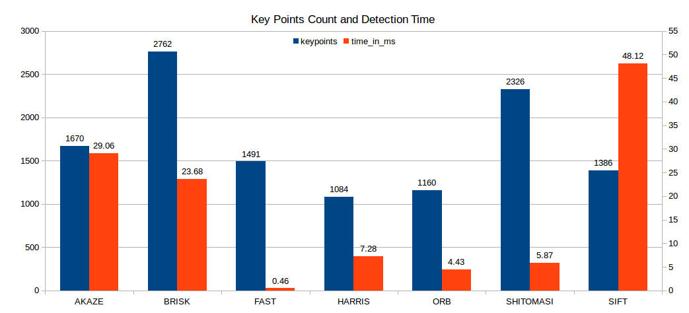
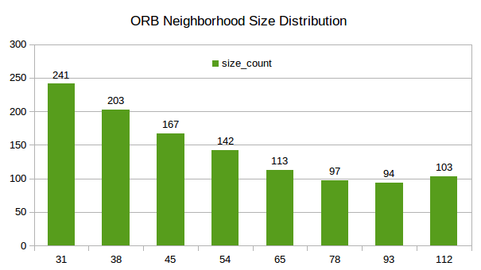
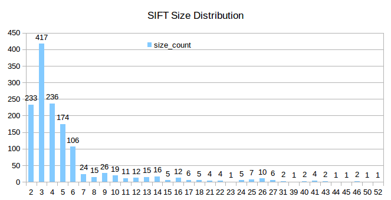
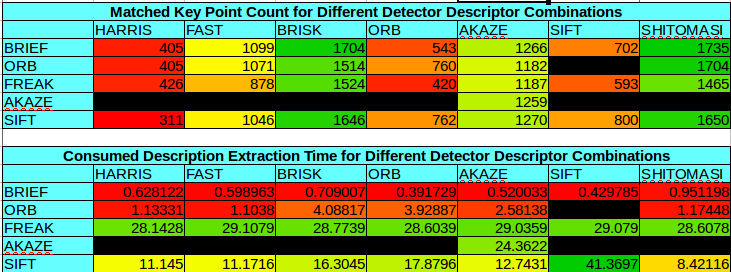
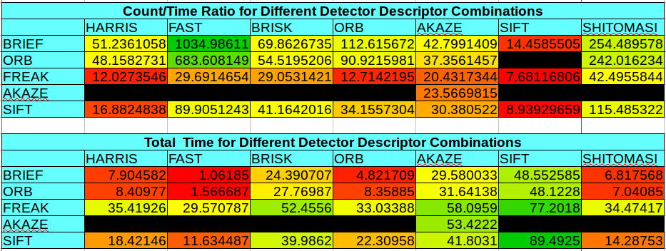

# SFND 2D Feature Tracking

The idea of the camera course is to build a collision detection system - that's the overall goal for the Final Project. As a preparation for this, you will now build the feature tracking part and test various detector / descriptor combinations to see which ones perform best. This mid-term project consists of four parts:

* First, you will focus on loading images, setting up data structures and putting everything into a ring buffer to optimize memory load. 
* Then, you will integrate several keypoint detectors such as HARRIS, FAST, BRISK and SIFT and compare them with regard to number of keypoints and speed. 
* In the next part, you will then focus on descriptor extraction and matching using brute force and also the FLANN approach we discussed in the previous lesson. 
* In the last part, once the code framework is complete, you will test the various algorithms in different combinations and compare them with regard to some performance measures. 

See the classroom instruction and code comments for more details on each of these parts. Once you are finished with this project, the keypoint matching part will be set up and you can proceed to the next lesson, where the focus is on integrating Lidar points and on object detection using deep-learning. 

## Dependencies for Running Locally
* cmake >= 2.8
  * All OSes: [click here for installation instructions](https://cmake.org/install/)
* make >= 4.1 (Linux, Mac), 3.81 (Windows)
  * Linux: make is installed by default on most Linux distros
  * Mac: [install Xcode command line tools to get make](https://developer.apple.com/xcode/features/)
  * Windows: [Click here for installation instructions](http://gnuwin32.sourceforge.net/packages/make.htm)
* OpenCV >= 4.1
  * This must be compiled from source using the `-D OPENCV_ENABLE_NONFREE=ON` cmake flag for testing the SIFT and SURF detectors.
  * The OpenCV 4.1.0 source code can be found [here](https://github.com/opencv/opencv/tree/4.1.0)
* gcc/g++ >= 5.4
  * Linux: gcc / g++ is installed by default on most Linux distros
  * Mac: same deal as make - [install Xcode command line tools](https://developer.apple.com/xcode/features/)
  * Windows: recommend using [MinGW](http://www.mingw.org/)

## Basic Build Instructions

1. Clone this repo.
2. Make a build directory in the top level directory: `mkdir build && cd build`
3. Compile: `cmake .. && make`
4. Run it with detector and descriptor type as arguments: `./2D_feature_tracking DetectorType DescriptorType ` . For example, if you want to use FAST detector and ORB descriptor, run it with command:  `./2D_feature_tracking FAST ORB`

## Test and Evaluation 

### Detector Test

1. ORB, SIFT, FAST, BRISK, AKAZE, HARRIS and SHITOMASI detectors were tested. 

2. Run the Task7.sh file in the top level directory: `./Task7.sh`

3. The results would be stored in the /Task7 folder. The txt files named after the corresponding detector name contains the keypoints count for all 10 images, average detection time consuming per frame and keypoints size distribution information. 

4. The results is illustrated by the bar chart below. The FAST detector has the highest keypoints count/time consuming ratio, while the SIFT detector has the lowest.

5. The neighborhood size in the result txt files has been ceiled to a integer. The FAST , HARRIS and SHITOMASI detector only have one neighborhood size, which are 7, 6 and 2 respectively.  The ORB has relative large size and Other detector size distribution can be found in the Task7 folder.  

   

   

## Descriptor Test

1. BRIEF, ORB, FREAK, AKAZE and SIFT descriptors were tested.  In the matching step, the BF approach is used with the descriptor distance ratio set to 0.8.
2. Run the Task8_9.sh file in the top level directory: `./Task8_9.sh`
3. The results were stored in the Matched_Keypoints_Results.txt file. It contains the matched keypoints count and time consuming for descriptor extraction. The spreadsheets of the measures are shown below.
4. The color scale stands for the value of measures: red is low, yellow is medium and green is high. Black means the combination is not compatible. 

## Results Evaluation and Recommendation  

The performance of the combinations were evaluated in terms of the matched keypoints count and its corresponding consumed time (detection+descriptor extraction). The combination that holds higher count/consumed _time ratio can be seen as a better choice. 

From the spreadsheet above, the TOP3 combinations are FAST-BRIEF, FAST-ORB and SHITOMASI-BRIEF. 